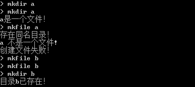

## 程序错误

提供给大家的文件系统存在以下错误，大家可以对这些错误进行修改：

 

1. - [x] 程序运行开始就越界崩溃（在有的编译环境可能没有该错误）。

 

2. - [x] 创建一个与目录同名的文件时，系统崩溃。

 

 

3. - [x] 重复创建文件目录时提示错误；重复创建同一个文件时出错，错误如下：

 

4. - [x] Dir命令，显示当前目录一直是“..”，请修改为正确的当前路径。

 

5. - [ ] 在根目录下面创建子目录a，在a中创建文件b，并写入大于一个块(512字节)的内容，之后返回根目录，查看目录内容的时候会出现错误。

 

 

6. - [x] Read或Write一个不存在的文件时，程序会崩溃

 

 

7. - [ ] 磁盘回收后再分配会出错，例如图中的第13个盘块就不见了。

 

 

8. - [ ] 系统其他错误。

 

## 建议增加的功能

1. - [ ] 现有的程序是用内存模拟磁盘，建议大家改用文件模拟磁盘。这样，新创建的文件和目录等可以保留在模拟磁盘中，下次重新登录系统，可以查看上次登录时创建的文件和目录；

2. - [ ] 增加新建用户的新功能：在命令行中输入“adduser ***”后，可以新增用户，新增的用户下次登录后仍然存在；

3. - [ ] 增加password命令可以修改用户密码；

4. - [ ] 增加查看当前用户信息的新功能：在命令行中输入“who”，可以显示当前用户的所有信息，包括这个用户的id号、登录密码、所属用户组等；

5. - [ ] 在命令提示符前加入路径；增加pwd命令用来显示当前路径；

6. - [ ] 文件名更名；

7. - [ ] 复制文件；

8. - [ ] 其他功能。